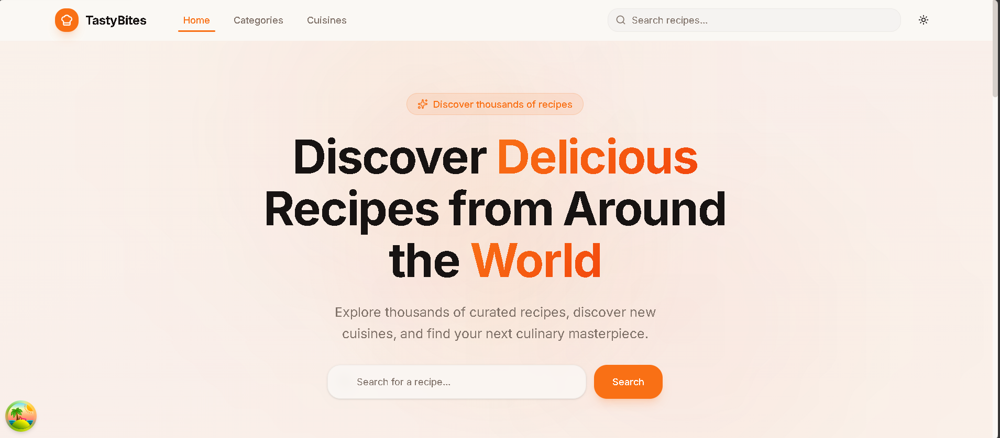

# 🍔 TastyBites

**TastyBites** is a modern recipe discovery web application built with cutting-edge frontend technologies. It provides a seamless experience for browsing meals by category and cuisine, searching recipes, and exploring detailed cooking instructions powered by TheMealDB API.

![Food-App Platform]



## ✨ Features

- 🍽️ **Recipe Discovery** – Browse a curated list of meal categories and cuisines from around the world.
- 🔍 **Smart Search** – Find recipes by name, category, cuisine, area, or ingredient.
- 📋 **Detailed Meal Pages** – View ingredients with measurements, step‑by‑step instructions, and embedded YouTube tutorials.
- 🎲 **Featured Recipe** – Discover a random meal on the homepage for inspiration.
- 🧭 **Breadcrumb Navigation** – Contextual breadcrumbs for easy orientation across pages.
- 🌙 **Dark Mode** – Toggle between light and dark themes (using `next-themes`).
- ⚡ **Optimized Data Fetching** – Caching and background updates via **TanStack Query**.
- 📱 **Responsive Design** – Fully responsive UI built with Tailwind CSS and shadcn/ui components.
- 🎬 **Smooth Animations** – Fade‑in, slide‑up, and stagger effects powered by Framer Motion and custom keyframes.

## 🛠️ Tech Stack

| Technology | Description |
|------------|-------------|
|  **React 19** | UI library for building component‑based interfaces. |
|  **Vite 8** | Next‑generation frontend tooling for fast development and builds. |
|  **TypeScript** | Static typing for enhanced developer experience and reliability. |
|  **Tailwind CSS v4** | Utility‑first CSS framework for rapid styling. |
|  **TanStack Query** | Data synchronization and caching layer. |
|  **Lucide React** | Beautiful open‑source icon library. |
|  **React Router DOM** | Declarative routing for React applications. |
|  **shadcn/ui** | Reusable, customizable component library built with Radix UI and Tailwind. |
|  **Framer Motion** | Production-ready motion library for React animations. |
|  **Sonner** | Toast notifications for React. |
|  **TheMealDB API** | Free, open-source meal recipe database. |

## 📦 Prerequisites

Make sure you have the following installed on your machine:

- [Node.js](https://nodejs.org/) (v18 or later)
- [npm](https://www.npmjs.com/) or [yarn](https://yarnpkg.com/) or [pnpm](https://pnpm.io/)

## 🚀 Getting Started

1. **Clone the repository**

   ```bash
   git clone https://github.com/FahdAmmar/FoodApp
   cd FoodApp
   ```

2. **Install dependencies**

   Using pnpm (recommended):

   ```bash
   pnpm install
   ```

   Or with npm:

   ```bash
   npm install
   ```

3. **Run the development server**

   ```bash
   pnpm run dev
   ```

   Open [http://localhost:5173](http://localhost:5173) in your browser.

   > ℹ️ **Note:** No environment variables required. The app uses the public **TheMealDB API** (`https://www.themealdb.com/api/json/v1/1`) out of the box.

4. **Build for production**

   ```bash
   pnpm run build
   ```

   The output will be in the `dist` folder.

5. **Preview the production build**

   ```bash
   pnpm run preview
   ```

## 📜 Available Scripts

| Script | Description |
|--------|-------------|
| `pnpm run dev` | Start the Vite development server. |
| `pnpm run build` | Type-check with TypeScript and build for production. |
| `pnpm run preview` | Preview the production build locally. |
| `pnpm run lint` | Run ESLint to check code quality. |

## 📂 Project Structure

```
├── 📁 public
│   ├── 🖼️ favicon.svg
│   └── 🖼️ icons.svg
├── 📁 src
│   ├── 📁 components
│   │   ├── 📁 ui
│   │   │   ├── 📄 accordion.tsx
│   │   │   ├── 📄 alert-dialog.tsx
│   │   │   ├── 📄 alert.tsx
│   │   │   ├── 📄 aspect-ratio.tsx
│   │   │   ├── 📄 avatar.tsx
│   │   │   ├── 📄 badge.tsx
│   │   │   ├── 📄 breadcrumb.tsx
│   │   │   ├── 📄 button.tsx
│   │   │   ├── 📄 calendar.tsx
│   │   │   ├── 📄 card.tsx
│   │   │   ├── 📄 carousel.tsx
│   │   │   ├── 📄 chart.tsx
│   │   │   ├── 📄 checkbox.tsx
│   │   │   ├── 📄 collapsible.tsx
│   │   │   ├── 📄 command.tsx
│   │   │   ├── 📄 context-menu.tsx
│   │   │   ├── 📄 dialog.tsx
│   │   │   ├── 📄 drawer.tsx
│   │   │   ├── 📄 dropdown-menu.tsx
│   │   │   ├── 📄 form.tsx
│   │   │   ├── 📄 hover-card.tsx
│   │   │   ├── 📄 input-otp.tsx
│   │   │   ├── 📄 input.tsx
│   │   │   ├── 📄 label.tsx
│   │   │   ├── 📄 menubar.tsx
│   │   │   ├── 📄 navigation-menu.tsx
│   │   │   ├── 📄 pagination.tsx
│   │   │   ├── 📄 popover.tsx
│   │   │   ├── 📄 progress.tsx
│   │   │   ├── 📄 radio-group.tsx
│   │   │   ├── 📄 resizable.tsx
│   │   │   ├── 📄 scroll-area.tsx
│   │   │   ├── 📄 select.tsx
│   │   │   ├── 📄 separator.tsx
│   │   │   ├── 📄 sheet.tsx
│   │   │   ├── 📄 sidebar.tsx
│   │   │   ├── 📄 skeleton.tsx
│   │   │   ├── 📄 slider.tsx
│   │   │   ├── 📄 sonner.tsx
│   │   │   ├── 📄 switch.tsx
│   │   │   ├── 📄 table.tsx
│   │   │   ├── 📄 tabs.tsx
│   │   │   ├── 📄 textarea.tsx
│   │   │   ├── 📄 toast.tsx
│   │   │   ├── 📄 toaster.tsx
│   │   │   ├── 📄 toggle-group.tsx
│   │   │   ├── 📄 toggle.tsx
│   │   │   ├── 📄 tooltip.tsx
│   │   │   └── 📄 use-toast.ts
│   │   ├── 📄 breadcrumb.tsx
│   │   ├── 📄 CategoryCard.tsx
│   │   ├── 📄 empty-state.tsx
│   │   ├── 📄 MealCard.tsx
│   │   ├── 📄 MealCardSkeleton.tsx
│   │   ├── 📄 MealGrid.tsx
│   │   ├── 📄 NavLink.tsx
│   │   ├── 📄 Navbar.tsx
│   │   ├── 📄 theme-provider.tsx
│   │   ├── 📄 theme-toggle.tsx
│   │   └── 📄 YouTubeEmbed.tsx
│   ├── 📁 hooks
│   │   ├── 📄 use-meals.ts
│   │   ├── 📄 use-mobile.tsx
│   │   └── 📄 use-toast.ts
│   ├── 📁 lib
│   │   ├── 📄 api.ts
│   │   └── 📄 utils.ts
│   ├── 📁 pages
│   │   ├── 📄 AreaPage.tsx
│   │   ├── 📄 CategoriesPage.tsx
│   │   ├── 📄 CategoryPage.tsx
│   │   ├── 📄 CuisinesPage.tsx
│   │   ├── 📄 Index.tsx
│   │   ├── 📄 IngredientPage.tsx
│   │   ├── 📄 MealDetailPage.tsx
│   │   ├── 📄 NotFound.tsx
│   │   └── 📄 SearchPage.tsx
│   ├── 📁 test
│   │   ├── 📄 example.test.ts
│   │   └── 📄 setup.ts
│   ├── 🎨 App.css
│   ├── 📄 App.tsx
│   ├── 🎨 index.css
│   ├── 📄 main.tsx
│   └── 📄 vite-env.d.ts
├── 📝 DESIGN_SYSTEM.md
├── ⚙️ .gitignore
├── 📝 README.md
├── ⚙️ components.json
├── 📄 eslint.config.js
├── 🌐 index.html
├── ⚙️ package.json
├── ⚙️ pnpm-lock.yaml
├── 📄 tailwind.config.js
├── ⚙️ tsconfig.app.json
├── ⚙️ tsconfig.json
├── ⚙️ tsconfig.node.json
└── 📄 vite.config.ts
```

## 🎨 Design System

The project includes a comprehensive design system documented in [`DESIGN_SYSTEM.md`](DESIGN_SYSTEM.md), covering:

- **Color System** – Primary brand color (vibrant orange), semantic colors, and full dark mode support.
- **Typography Scale** – Headings, body text, and captions with defined sizes and weights.
- **Spacing System** – Consistent container, section, and component spacing.
- **Component Patterns** – Reusable patterns for cards, buttons, badges, and search inputs.
- **Accessibility** – Focus states, semantic HTML, and WCAG AA color contrast compliance.
- **Animations** – Fade-in, slide-up, and stagger keyframe utilities.

## 🔌 API Reference

This project consumes the free public **[TheMealDB API](https://www.themealdb.com/api.php)**. Key endpoints used:

| Endpoint | Description |
|----------|-------------|
| `search.php?s={query}` | Search meals by name. |
| `lookup.php?i={id}` | Get full meal details by ID. |
| `categories.php` | List all meal categories. |
| `filter.php?c={category}` | Filter meals by category. |
| `filter.php?a={area}` | Filter meals by cuisine/area. |
| `filter.php?i={ingredient}` | Filter meals by ingredient. |
| `random.php` | Get a single random meal. |
| `list.php?a=list` | List all available cuisines/areas. |

## 🤝 Contributing

Contributions are welcome! Please follow these steps:

1. Fork the repository.
2. Create a new branch (`git checkout -b feature/amazing-feature`).
3. Commit your changes (`git commit -m 'Add some amazing feature'`).
4. Push to the branch (`git push origin feature/amazing-feature`).
5. Open a Pull Request.

## 📄 License

This project is licensed under the MIT License. See the [LICENSE](LICENSE) file for details.

---

Made with ❤️ using the modern React ecosystem.
